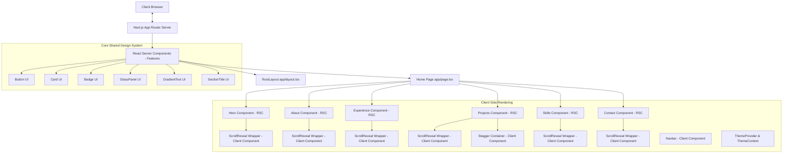
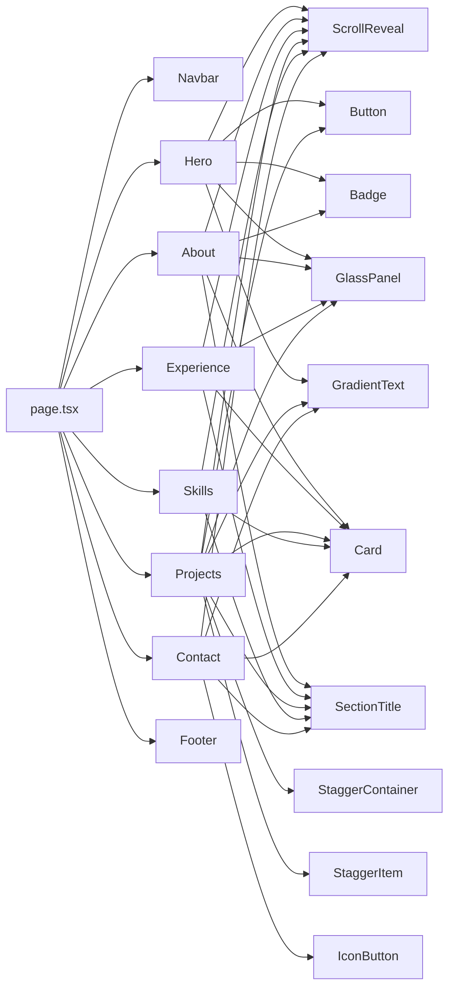

# Enterprise Next.js Portfolio — Reference Implementation

A modern, high-performance, and fully accessible portfolio website engineered using **Next.js 15**, **React 19**, **TypeScript**, and **Tailwind CSS**. This repository serves as an enterprise-grade reference implementation demonstrating modern frontend engineering architecture, clean code principles, performance optimizations, and state-of-the-art accessibility standards.

[](https://pratham-portfolio-gamma.vercel.app)
[](https://pratham-portfolio-gamma.vercel.app)
[](https://pratham-portfolio-gamma.vercel.app)

---

## 🔗 Live Demo & Preview

* **Live Site:** [pratham-portfolio-gamma.vercel.app](https://pratham-portfolio-gamma.vercel.app)
* **Preview Screenshot:**
  
  ```text
  ┌─────────────────────────────────────────────────────────────┐
  │  PRATHAM MODI   [About] [Experience] [Projects]  [Contact Me]│
  ├─────────────────────────────────────────────────────────────┤
  │                                                             │
  │     Building scalable and reliable systems.                 │
  │     I'm Pratham Modi, a Java Full Stack Developer...        │
  │                                                             │
  │     [ View Projects ]     [ Resume ↓ ]                      │
  │                                                             │
  └─────────────────────────────────────────────────────────────┘
  ```

---

## 🚀 Key Features

* **RSC-First Architecture:** Maximized use of React Server Components to minimize client-side JavaScript overhead.
* **Shared UI System:** Custom-built, accessible, and type-safe design system using Class Variance Authority (CVA).
* **Decoupled Animation Engine:** Client-side scroll animations encapsulated in reusable wrappers (`ScrollReveal`, `Stagger`), allowing underlying panels to compile as static Server Components.
* **Persistent Theme Engine:** Seamless light/dark mode system integration.
* **Enterprise SEO & Meta:** Fully dynamic Sitemap & Robots handlers, OpenGraph/Twitter previews, and JSON-LD Person schema injections.
* **Responsive Design:** Premium mobile-first layouts with smooth transitions.

---

## 🛠️ Tech Stack

* **Framework:** Next.js 15 (App Router)
* **Library:** React 19
* **Styles:** Tailwind CSS
* **Animations:** Framer Motion
* **Tooling:** ESLint 9 (Flat Config), Prettier, EditorConfig
* **Icons:** Lucide React
* **Hosting:** Vercel

---

## 📁 Folder Structure

The repository is structured following modern domain-driven directory standards:

```text
├── app/                  # App Router entry routes, page definitions, & globals
├── components/           # Core shared design system & modular utilities
│   ├── animations/       # Reusable Client animation wrappers (ScrollReveal, Stagger)
│   └── ui/               # CVA-driven primitive UI components (Button, Card, Badge)
├── constants/            # Hardcoded site configurations (Experience, projects, navigation)
├── features/             # Feature-specific page segments (Hero, About, Projects)
├── hooks/                # Custom React hook utilities (useTheme)
├── lib/                  # Library initializers (Google Fonts, site SEO metadata config)
├── providers/            # Client context state providers (ThemeProvider)
├── public/               # Static assets (favicons, PDFs, images)
└── types/                # Strict TypeScript declaration types
```

---

## 🏛️ Architecture & Rendering Strategy

The project implements a hybrid **Server-Components-First** rendering strategy. React Server Components (RSC) are utilized by default for rendering layouts, metadata, and static HTML content directly on the server. Client-side execution is isolated strictly to interactive elements (theme toggling, mobile navigation) and animation layers.

### Architectural Layout



### Component Dependency Tree



---

## ⚡ Performance Optimizations

1. **RSC Conversion:** Moving Framer Motion out of core layouts resulted in a **6.2 kB decrease** in the main route bundle size and a **6 kB decrease** in First Load JS.
2. **Next.js Image:** Automatic resizing, Avif/Webp compression, and priority loading tags to eliminate Largest Contentful Paint (LCP) delays.
3. **Google Fonts Optimization:** Preconnected fonts utilizing `next/font/google` to eliminate layout shifts (CLS) and custom system fallback chains.
4. **Conditional Bundle Analysis:** Built-in dev bundle inspections via `@next/bundle-analyzer` to prevent third-party bundle leaks.

---

## ♿ Accessibility (a11y)

* **Landmarks:** Semantically structured layouts utilizing `<main>`, `<nav>`, and `<footer>` tags.
* **Heading Hierarchy:** Logical header progression starting with exactly one `<h1>` in the Hero and sequential `<h2>` elements.
* **Focus States:** Focus indicators on interactive controls with `focus-visible:ring-2` to support keyboard navigation.
* **Screen Readers:** Complete custom label structures via `aria-label` tags on icon buttons and navigation elements.

---

## 🔍 Search Engine Optimization (SEO)

* **Structured Data:** Automated injection of JSON-LD Person schema details on layouts.
* **Metadata Route Handlers:** Dynamic, automated XML sitemap generators (`sitemap.xml`) and index mapping specifications (`robots.txt`).
* **Canonical URL Alternatives:** Meta alternate tags to prevent duplicate crawler entries.
* **Social Preview Cards:** Configured OpenGraph (`og:image`) and Twitter Cards.

---

## 💻 Installation & Setup

### Requirements

* Node.js 18.0 or higher
* npm / yarn / pnpm

### Quickstart

1. **Clone the Repository:**
   ```bash
   git clone https://github.com/prathammodi12/pratham-portfolio.git
   cd pratham-portfolio
   ```

2. **Install Dependencies:**
   ```bash
   npm install
   ```

3. **Configure Environment:**
   ```bash
   cp .env.example .env.local
   ```
   Modify `NEXT_PUBLIC_SITE_URL` to match your development port (e.g. `http://localhost:3000`).

4. **Boot Development Server:**
   ```bash
   npm run dev
   ```
   Open [http://localhost:3000](http://localhost:3000) to view the application.

---

## 🛠️ Terminal Scripts

* `npm run dev`: Boots the development environment.
* `npm run build`: Compiles, typechecks, and outputs production bundle assets.
* `npm run start`: Runs compiled assets.
* `npm run lint`: Triggers the ESLint validation checks.
* `ANALYZE=true npm run build`: Compiles project and fires the bundle analyzer browser visuals.

---

## ⚖️ License

Distributed under the MIT License. See [LICENSE](LICENSE) for details.
